# 地名标签云可视化系统 - 用户手册

## 概述

最后更新时间：2025年12月6日

### 1. 项目定位

`fabricTagCloud4` 是一个面向 **地理信息可视化** 与 **空间数据分析** 的专业级可视化系统。系统深度融合高德地图 API、POI（Point of Interest）数据挖掘与 Fabric.js 画布渲染引擎，构建了从 **地图展示 → 数据筛选 → 标签云生成 → 样式定制** 的完整数据可视化工作流。系统特别强化了 **多角度径向移位算法**、**多尺度标签云渲染** 与 **实时参数联动渲染** 等核心能力，可应用于旅游景点分析、区域热点识别、地理教学演示、空间数据探索等场景。

### 2. 核心特性

#### 2.1 中心型标签云布局算法

- **多角度径向移位算法**：基于 Fabric.js 相关接口，复用其对象模型与事件机制，创新性地构建文本标签的多角度径向移位算法，其中包括自适应范围扫描、最优步长偏移等步骤
- **全局无压盖绘制**：在保证局部单一标签尽量无偏的前提下，完成了全局无压盖的标签云绘制
- **视觉变量映射**：采用色带属性来表示各标签距离中心位置的远近，利用字体大小来表征地点的重要性或优劣程度

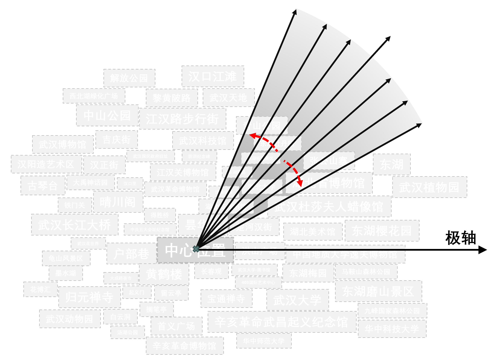

#### 2.2 多尺度标签云渲染

系统构建**多尺度模型**，支持兼顾全局与局部效应的中心型标签云预览漫游。其参照传统地图在应对尺度效应时采用的方法策略，具体指的是**层级结构设计思想**：通过在不同的层次上呈现标签，以应对不同的地理尺度；具体而言，在较大的尺度下减少标签数量，而在较小尺度下展示更为详细和精细的标签信息，以实现对标签云的自主探索与调整。

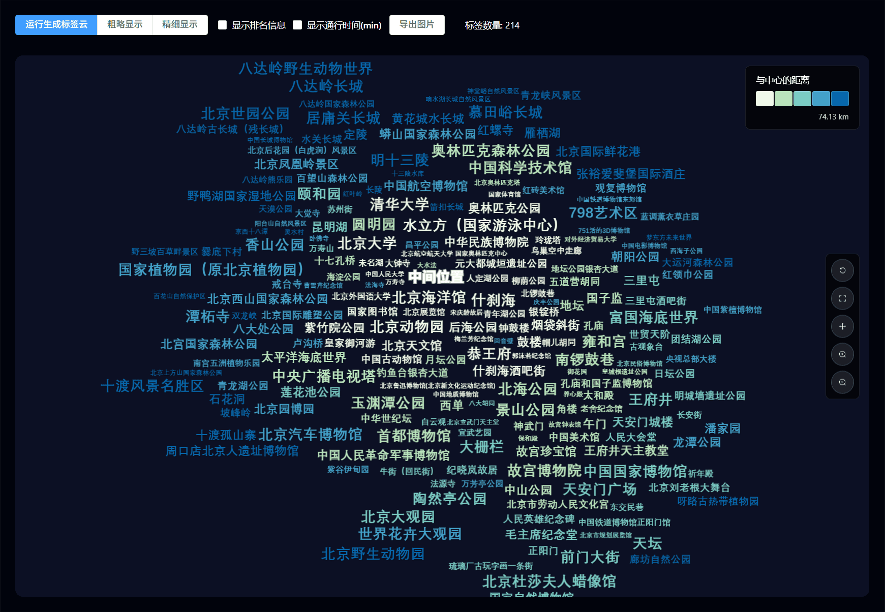

#### 2.3 实时可视化参数联动

系统采用 **Vue 3 Composition API + Pinia 状态管理** 架构，实现多面板参数的实时同步与标签云画布的即时渲染：

- **字体面板**：语言（中英文）、字体类别数量、字号大小、字重、字体类型
- **配色面板**：背景色与文字色自定义、色带配置、配色数量、渲染方式（分位数、相等间隔、几何间隔、自然间断点、标准差等）
- **数据管理**：POI 数据筛选、编辑

所有参数修改均通过 Pinia Store 统一管理，确保多组件间的数据一致性。

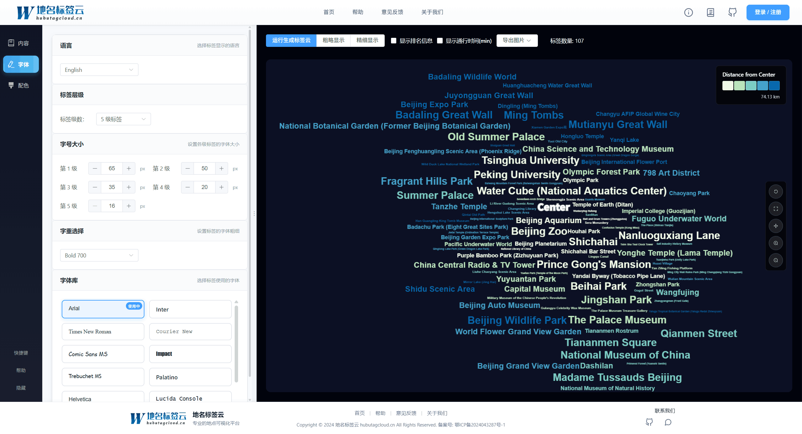

#### 2.4 高级可视化特性

- **动态排名与时间显示**：支持显示兴趣点在当前城市的排名，以及距离中心点的通行时间（通过高德 Web 驾车 API 动态获取）
- **标签交互**：鼠标悬浮高亮、点击查看详情、图例联动显示
- **画布操作**：返回中心位置、返回原始缩放、漫游、放大、缩小等交互功能

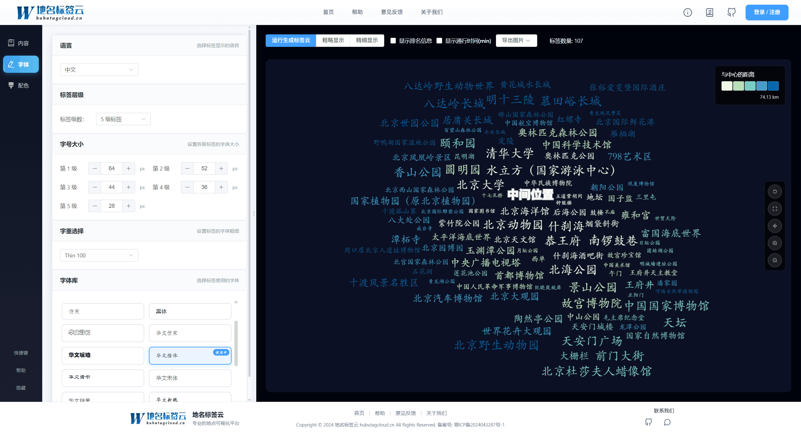

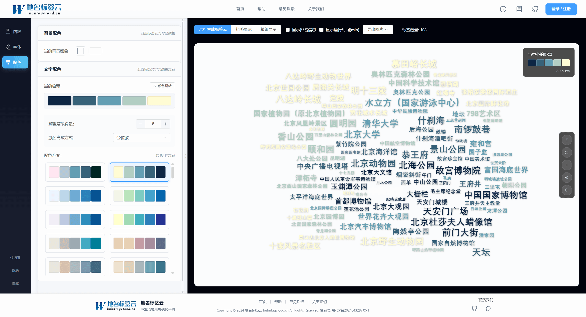

---

## 快速上手

最后更新时间：2025年12月6日

系统采用 **六步工作流** 实现从数据筛选到标签云生成的全流程操作：

### 1. **系统首页与界面导航**

系统采用响应式布局设计，左侧为地图工作区和数据管理面板，右侧为标签云画布预览区。首次使用可通过 Intro.js 引导快速了解界面布局。

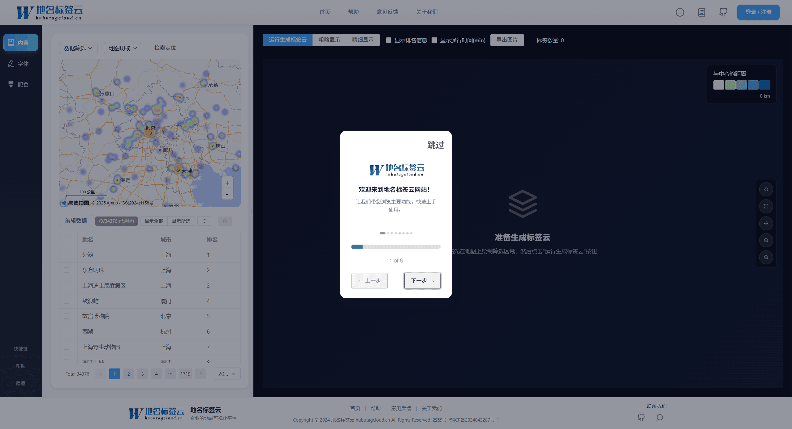

### 2. **查看兴趣点数据**

可以通过**地图**查看目前系统内存储的**兴趣点数据**。系统初始界面将会展示用户所在定位的**高德地图**，并以**点覆盖物与热力图**结合的形式展示全国范围内的**景点POI数据**。

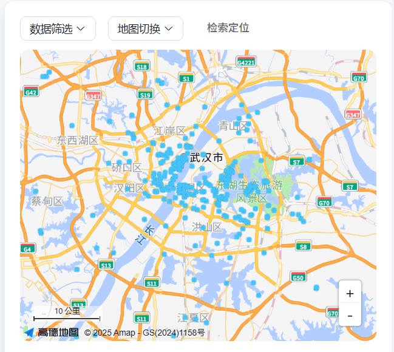

### 3. **兴趣点数据筛选**

可以对其中的数据进行筛选，并通过**二维表**查看目前筛选的数据。用户通过地图显示模块的**数据筛选**功能，在地图上绘制不同的**面状覆盖物**（圆形、矩形、多边形），即可在系统中筛选对应的点数据。

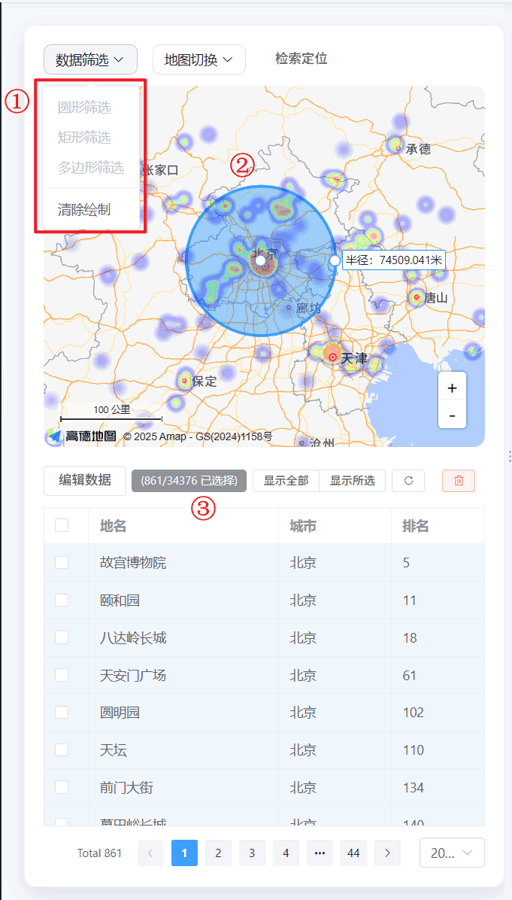

### 4. **生成地名标签云**

单击**运行生成标签云**之后，系统将会对用户所框选的兴趣点数据进行筛选，并默认采用**分位数法**对其字号、颜色进行设置，接着使用内置的**压盖检测与多角度径向偏移策略**绘制不重叠且限定偏移的地名标签云。

### 5. **字体修改**

在**字体**栏目可以对当前的标签云的字体属性进行更改，包括**语言、字号、字重、字体**属性。其每一修改，将会对已绘制的地名标签云进行**实时更新**。

### 6. **配色修改**

在**配色**栏目可以对当前的标签云的配色属性进行更改，包括**背景色、色带**。其中，**配色数量**即是将所有文本标签划分为几种颜色；而**渲染方式**即是包括**相等间隔**、**分位数**、**自然间断点**、**几何间隔**、**标准差**等符号渲染方式。其每一修改，将会对已绘制的地名标签云进行**实时更新**。

---

## 入门教程

最后更新时间：2025年12月6日

### 一、功能面板详解

#### 1. 地图显示模块

地图工作区基于 **高德地图 JSAPI** 构建，提供丰富的地图交互能力：

- **地图图层切换**：
  - **点状图层**：在大比例尺地图下，以点标记方式展示 POI 位置，适合精确查看点位信息
  - **热力图层**：在小比例尺地图下，根据 POI 密度生成热力图，适合展示区域热点分布
  - **底图切换**：支持标准地图、卫星图等多种底图风格

- **地图交互功能**：
  - **鼠标滚轮缩放**：支持鼠标滚轮对地图进行缩放操作
  - **鼠标拖拽**：支持鼠标拖拽实现地图漫游
  - **地点检索**：在检索框中输入地点名称，高德地图自动定位并缩放至该地点
  - **POI 悬浮提示**：当鼠标悬浮于某一景点 POI 上时，显示该景点的名称

- **地图工具**：
  - **放缩按钮**：提供地图缩放控制
  - **比例尺**：显示当前地图比例尺
  - **地图切换工具**：支持切换标准地图和卫星遥感地图

.png "scale:50%")

#### 2. 数据管理模块

##### 2.1 数据显示

系统初始界面将会以**二维数据表**的形式展示当前系统存储的**兴趣点数据**，系统内默认存储的是全国的景点兴趣点数据。

- **数据编辑**：
  - 单击**编辑表格**后，用户可以对二维表格内的数据进行修改
  - 再次单击**停止编辑**后，即可将编辑内容保存至系统

- **数据选择操作**：
  - **复选框选择**：使用鼠标单击单行数据记录前面的复选框，即可选中该数据记录
  - **切换选择**：将选中与未选中的记录进行切换
  - **清空选择**：将所有选中项目进行清空
  - **删除选择**：对选中的项目进行删除

- **数据显示切换**：
  - **显示所有记录**：显示系统中的所有数据记录
  - **显示所选记录**：仅显示当前选中的数据记录

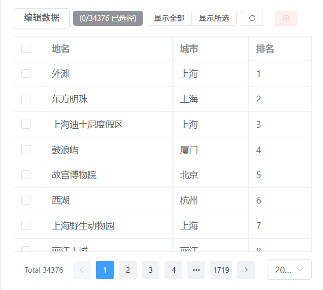

##### 2.3 数据筛选

用户可以将**地图显示模块**与**数据显示模块**进行交互，即用户通过地图显示模块的**数据筛选**功能，在地图上绘制不同的**面状覆盖物**，即可在系统中筛选对应的点数据，以此筛选即将参与绘制标签云的兴趣点数据。

其中绘制的面状覆盖物支持用户绘制：
- **圆形覆盖物**：以圆心和半径定义圆形区域
- **矩形覆盖物**：以对角两点定义矩形区域
- **多边形覆盖物**：以多个顶点定义任意多边形区域

同时也支持用户通过**清除绘制**将所有的覆盖物与已筛选数据进行清除。

#### 3. 标签云生成模块

##### 3.1 生成标签云

用户在地图显示模块进行数据筛选之后，单击**运行生成标签云**，系统将会对用户所框选的兴趣点数据进行筛选，并采用**分位数法**对其字号、颜色进行设置，接着使用内置的**压盖检测与多角度径向偏移策略**绘制不重叠且基本无偏的地名标签云。

本系统基于**Fabric.js**相关接口，复用其对象模型与事件机制，创新性地构建**文本标签的多角度径向移位算法**，其中包括**自适应范围扫描**、**最优步长偏移**等步骤。通过这些算法，在保证局部单一标签尽量无偏的前提下，完成了**全局无压盖的标签云绘制**。

在已绘制的标签云中，系统采用了**色带属性**来表示各标签距离中心位置的远近，并利用**字体大小**来表征地点的重要性或优劣程度。这种绘制方式旨在提高标签云的可视化效果，使得用户能够更直观地理解标签的空间分布和相对重要性。

##### 3.2 添加排名与时间

在用户单击**显示排名信息**或是**显示通行时间(min)**之后，将会动态在各标签后面添加显示该兴趣点在当前城市的排名或是距离中心点的通行时间，其中通行时间是通过**高德Web驾车API**进行动态获取。

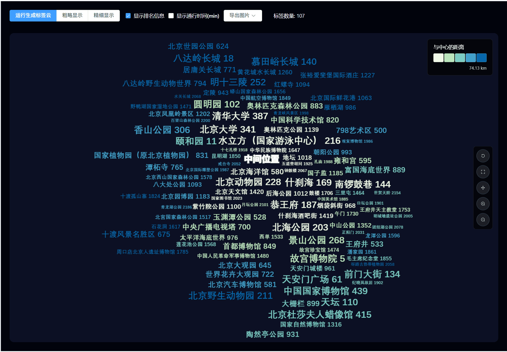

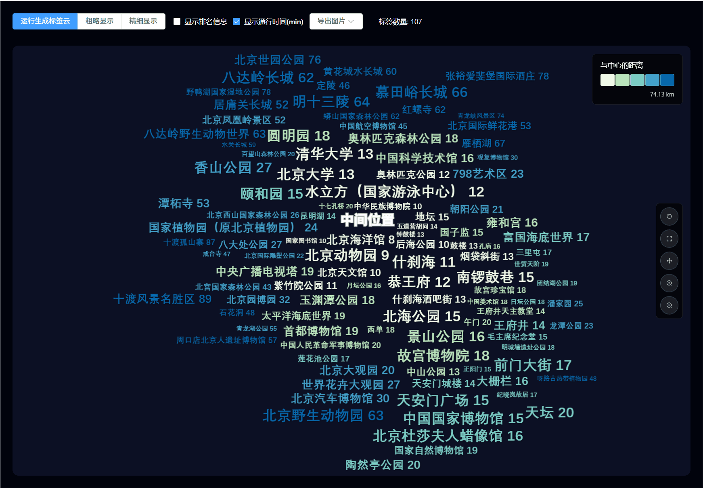

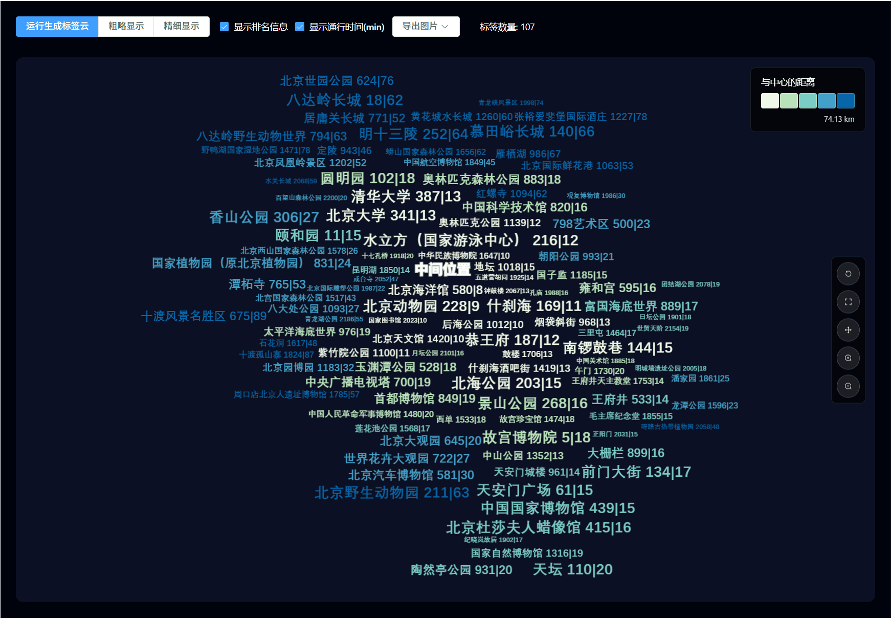

##### 3.3 多尺度效应

用户可以通过单击**精细显示**与**粗略显示**，调用**地理多尺度模型**对展示在图层上的标签数量进行增减。

系统构建的**多尺度模型**，支持兼顾全局与局部效应的中心型标签云预览漫游。其参照传统地图在应对尺度效应时采用的方法策略，具体指的是**层级结构设计思想**：通过在不同的层次上呈现标签，以应对不同的地理尺度；具体而言，在较大的尺度下减少标签数量，而在较小尺度下展示更为详细和精细的标签信息，以实现对标签云的自主探索与调整。

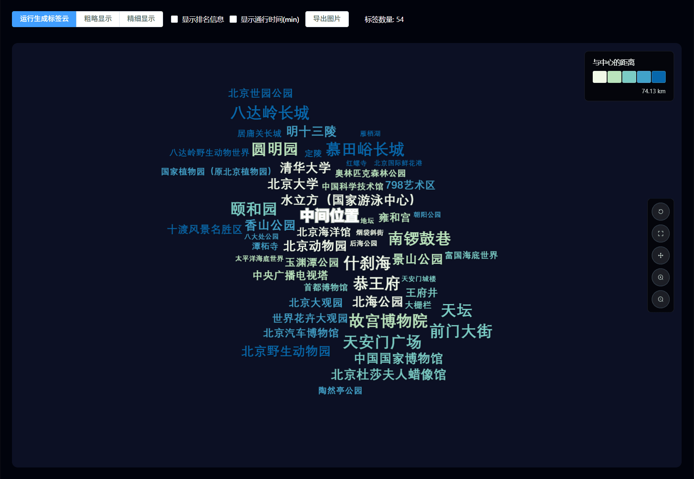

#### 4. 字体交互模块

系统可单击左侧导航栏**字体**切换至**字体改变交互模块**。在此模块下，用户可以对**标签语言**、**字体类别数量**、**字号大小**、**字重**、**字体**进行修改。其每一修改，将会对已绘制的地名标签云进行**实时更新**。

- **标签语言**：切换所生成的标签云的语言，目前支持中文/英文切换

- **字体类别数量**：将标签按照权重划分为多个类别，每个类别使用不同的字号

- **字号大小**：为每个类别设置字号范围，系统根据权重在范围内线性映射

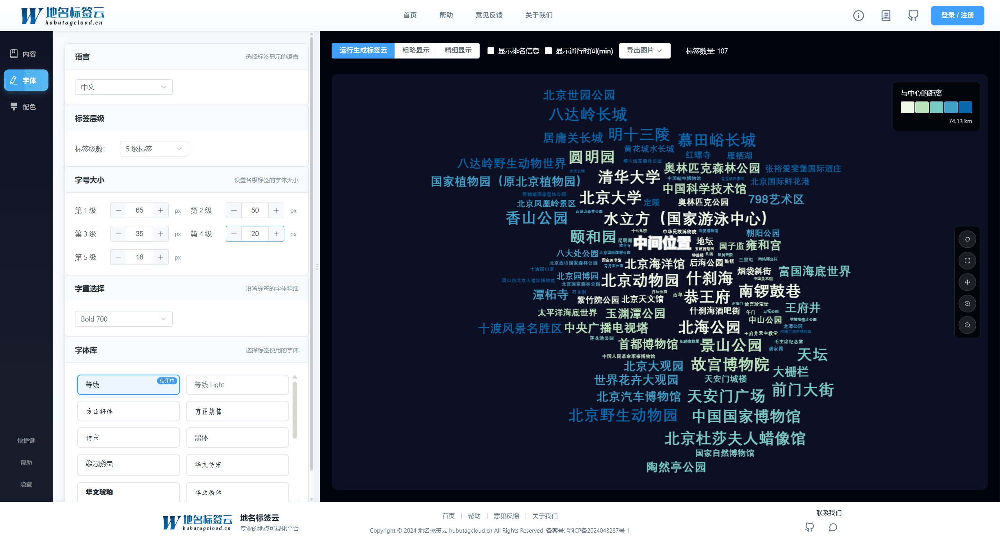

- **字重**：设置标签的字体粗细（100-900），影响标签的视觉突出程度

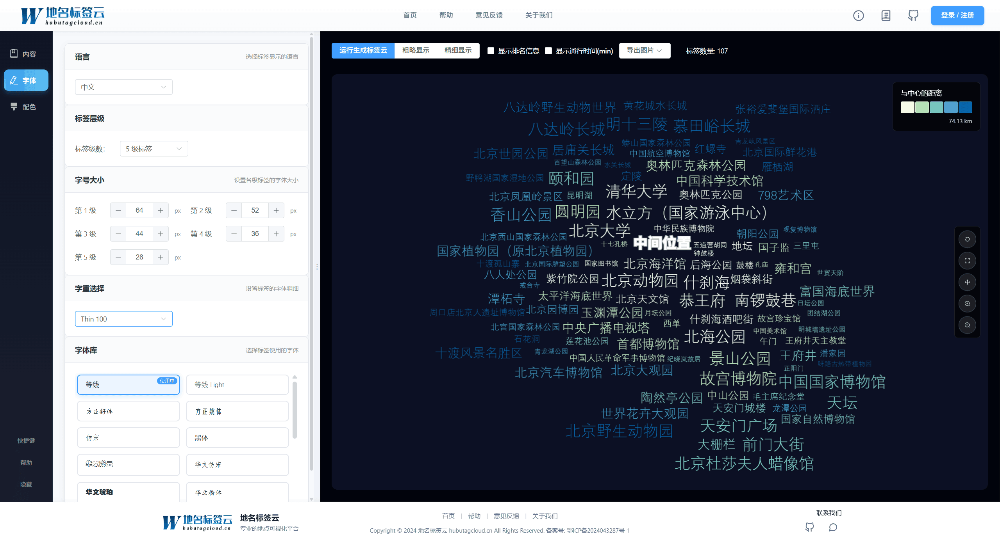

- **字体**：选择标签使用的字体族（中文字体、英文字体）

#### 5. 配色交互模块

系统可单击左侧导航栏**配色**切换至**配色改变交互模块**。在此模块下，用户可以对**标签云背景**、**色带**、**配色数量**、**渲染方式**进行修改。其中，**配色数量**即是将所有文本标签划分为几种颜色；而**渲染方式**即是包括**相等间隔**、**分位数**、**自然间断点**、**几何间隔**、**标准差**等符号渲染方式。其每一修改，将会对已绘制的地名标签云进行**实时更新**。

- **背景色**：设置标签云画布的背景颜色，推荐使用浅色背景以突出标签文字
- **色带配置**：提供预设的色带方案，支持自定义颜色编辑
- **配色数量**：将标签按照权重划分为多个颜色类别
- **渲染方式**：
  - **分位数**：按照数据分位数划分，适合数据分布不均匀的情况
  - **相等间隔**：按照相等数值间隔划分，适合数据分布均匀的情况
  - **几何间隔**：按照几何级数划分，适合数据跨度较大的情况
  - **自然间断点**：按照自然聚类划分，适合数据有明显分组的情况
  - **标准差**：按照标准差划分，适合数据符合正态分布的情况

#### 6. 其余交互功能

- **图例高亮**：在用户鼠标悬浮至某一**图例**上时，将会动态将对应类别的标签进行**高亮显示**。

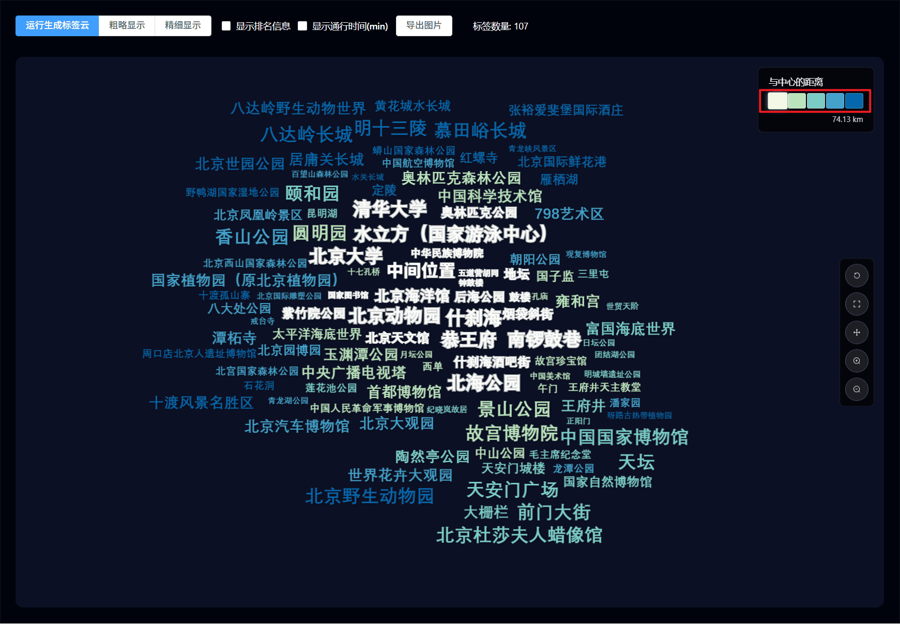

- **标签详情**：在用户单击某一标签后，将会调用**地点详情信息窗口**，在其上展示该景点的**地点名**、**经纬度**、**与中心点之间的距离**、**在该城市的排名**等信息。

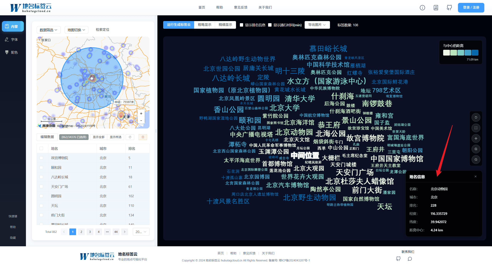

- **画布操作**：在系统窗口右侧还存在一竖排功能栏，具体包括**返回中心位置**、**返回原始缩放**、**漫游**、**放大**、**缩小**，用户可通过这一系列功能进行交互操作。

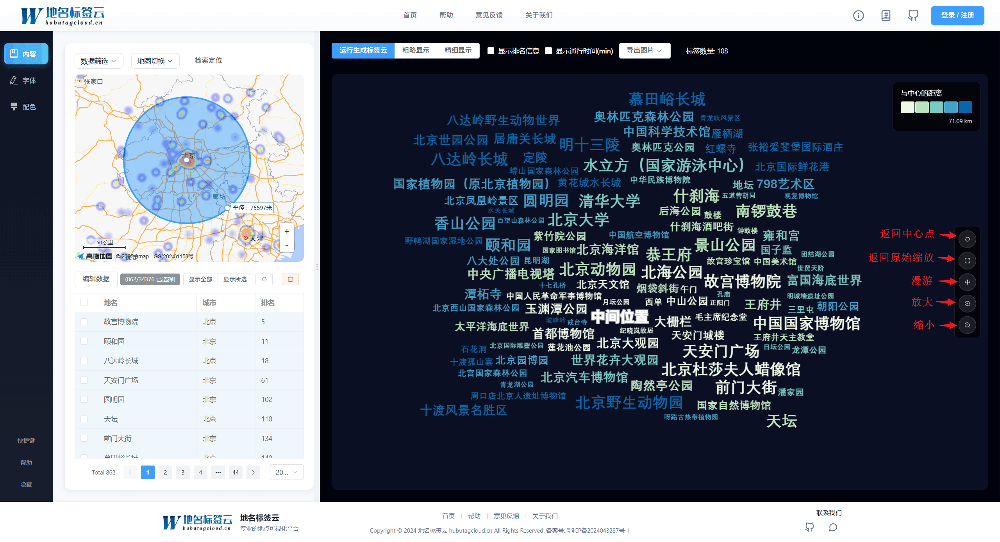

### 二、常见问题与故障排除

#### 1. 标签云生成失败

**问题描述**：点击"运行生成标签云"后，画布上没有显示标签。

**可能原因与解决方案**：
- **数据筛选为空**：没有在地图上绘制筛选区域或筛选区域内没有 POI 数据
  - **解决方案**：在地图上绘制筛选区域，确保区域内包含 POI 数据

#### 2. 标签重叠问题

**问题描述**：生成的标签云中存在标签重叠现象。

**可能原因与解决方案**：
- **标签数量过多**：在较小区域内筛选了过多的 POI 数据
  - **解决方案**：使用"粗略显示"模式减少标签数量，或扩大筛选区域
- **字号设置过大**：字号范围设置过大导致标签尺寸过大
  - **解决方案**：在字体面板中调整字号范围，减小最大字号

#### 3. 地图加载失败

**问题描述**：地图无法正常显示或加载。

**可能原因与解决方案**：
- **网络连接问题**：无法访问高德地图 API
  - **解决方案**：检查网络连接，确保可以访问高德地图服务
- **API Key 配置错误**：高德地图 API Key 配置不正确
  - **解决方案**：检查项目配置中的高德地图 API Key 是否正确

### 三、应用案例与最佳实践

#### 案例1：旅游景点分析与推荐

**应用场景**：旅游规划、景点推荐、旅游路线分析

**操作流程**：
1. 在地图上绘制或选择目标区域（如某个城市或景区范围）
2. 系统自动筛选该区域内的景点 POI 数据
3. 根据景点评分或热度设置权重，实现字号分级
4. 调整配色方案，使用暖色调突出旅游主题
5. 使用"精细显示"模式查看详细景点信息
6. 点击标签查看景点详情，辅助旅游决策

#### 案例2：区域热点识别与分析

**应用场景**：商业分析、市场研究、区域规划

**操作流程**：
1. 导入自定义行业数据集（如连锁门店、产业园区等）
2. 根据业务指标（如门店数量、销售额等）设置权重
3. 使用"粗略显示"模式查看整体分布
4. 使用"精细显示"模式查看局部热点
5. 分析区域热点与覆盖空白，为业务决策提供数据支持

#### 案例3：地理教学演示与可视化

**应用场景**：地理教学、空间分析教学、数据可视化教学

**操作流程**：
1. 选择典型的地理区域案例（如某个城市、某个景区）
2. 系统自动识别并展示相关地理信息
3. 采用学术风格的配色方案（低饱和度、高对比度）
4. 使用多尺度模型展示不同层次的地理信息
5. 通过标签交互功能，深入探索地理空间数据

---

## 技术文档与参考资料

最后更新时间：2025年12月6日

### 1. 官方文档

- [概述/快速上手/入门教程（PDF 合集）]()（待更新）

### 2. 技术参考

- **Fabric.js 官方文档**：[https://fabricjs.com/](https://fabricjs.com/)
- **Vue 3 官方文档**：[https://cn.vuejs.org/](https://cn.vuejs.org/)
- **Pinia 状态管理文档**：[https://pinia.vuejs.org/zh/](https://pinia.vuejs.org/zh/)
- **Element Plus 组件库文档**：[https://element-plus.org/zh-CN/](https://element-plus.org/zh-CN/)
- **高德地图 JSAPI 文档**：[https://lbs.amap.com/api/javascript-api/summary](https://lbs.amap.com/api/javascript-api/summary)
- **Vite 构建工具文档**：[https://cn.vitejs.dev/](https://cn.vitejs.dev/)

### 3. 学术论文与理论参考

- **中心型标签云**：
  - [以用户地理位置为中心的兴趣点标签云 (成晓强 et al.,2024)](https://d.wanfangdata.com.cn/periodical/dqxxkx202401009)
  - [Lbs tag cloud: a centralized tag cloud for visualization of points of interest in location-based services (Cheng Xiaoqiang et al.,2023)](https://www.mdpi.com/2220-9964/12/9/360)
- **标签云布局算法**：
  - [Wordle: Creating Word Clouds (Viegas et al., 2009)](https://hci.stanford.edu/cstr/reports/2009-03.pdf)
  - [Tag Clouds and the Case for Vernacular Visualization (Rivadeneira et al., 2007)](https://www.researchgate.net/publication/220195182_Tag_Clouds_and_the_Case_for_Vernacular_Visualization)
- **多尺度可视化**：
  - [Multi-Scale Visualization of Large Spatial Datasets (Zhou et al., 2010)](https://ieeexplore.ieee.org/document/5453102)

---

## 视频教程专区

最后更新时间：2025年12月6日

### 1. 基础教程

- **系统概述与快速上手**（筹备中）
  - 系统功能介绍
  - 界面布局说明
  - 快速生成第一个标签云

- **数据管理与筛选**（筹备中）
  - 数据查看与编辑
  - 数据导入操作
  - 地图数据筛选

### 2. 进阶教程

- **标签云生成与优化**（筹备中）
  - 多角度径向移位算法原理
  - 标签云生成流程
  - 多尺度模型使用

- **可视化参数调优实战**（筹备中）
  - 字体分级与权重映射
  - 配色方案设计
  - 实时参数联动

### 3. 应用案例

- **旅游景点分析案例**（筹备中）
- **区域热点识别案例**（筹备中）
- **地理教学演示案例**（筹备中）

*更多演示视频，后续持续更新*

---

## 技术支持与社区

最后更新时间：2025年12月6日

### 1. 项目资源

- **在线演示**：[https://www.hubutagcloud.cn/](https://www.hubutagcloud.cn/)
- **项目主页**：访问项目主页获取最新版本、更新日志和开发文档
- **GitHub 仓库**：（如有）访问项目 GitHub 仓库获取源代码和问题反馈

### 2. 问题反馈与技术支持

- **问题反馈**：
  - 在项目主页提交反馈，详细描述问题现象、复现步骤和预期行为
  - 发送邮件至项目维护团队，主题注明 "fabricTagCloud4 问题反馈"

- **功能建议**：
  - 在项目主页提交功能建议，描述功能需求和使用场景
  - 发送邮件至项目维护团队，主题注明 "fabricTagCloud4 功能建议"

- **技术支持**：
  - 如需行业定制、技术咨询或深度技术支持，欢迎联系项目维护团队
  - 我们将在 3-5 个工作日内回复您的咨询

### 3. 贡献与参与

我们欢迎社区贡献，包括但不限于：
- **代码贡献**：提交 Pull Request，改进功能或修复 Bug
- **文档完善**：改进用户手册、添加使用案例、翻译文档
- **测试反馈**：测试新功能、报告 Bug、提供使用反馈
- **功能扩展**：开发插件、扩展算法、集成第三方服务

### 4. 开发团队

本项目由 **湖北大学制图组** 开发维护，团队研究方向包括：
- **时空大数据可视化**：利用大数据技术与可视化方法，将地理信息、兴趣点数据与空间分析结果以直观方式呈现
- **泛地图学理论与方法**：探索新型地图可视化方法，包括隐喻地图和创新可视化技术

更多团队信息请访问：[湖北大学制图组官网](https://www.hubutagcloud.cn/cxq-group/)

---

## 版本更新日志

最后更新时间：2025年12月6日

### Version 4.0（当前版本）

- **核心功能**：
  - 基于 Vue 3 + Pinia 重构，提升性能和开发体验
  - 集成高德地图 JSAPI，支持地图展示、POI 数据筛选等功能
  - 实现多角度径向移位算法，完成全局无压盖的标签云绘制
  - 支持多尺度标签云渲染，实现全局与局部效应的兼顾观测
  - 支持动态排名与时间显示，增强标签信息表达

- **用户体验**：
  - 响应式布局设计，适配不同屏幕尺寸
  - Intro.js 引导功能，降低首次使用门槛
  - 实时参数联动，所有修改即时反映到标签云画布
  - 支持数据定制化导入，拓展应用场景

- **技术架构**：
  - 使用 Vite 5 构建工具，提升开发效率
  - 基于 Fabric.js 实现标签云渲染
  - 集成 Element Plus 提供现代化 UI 组件
  - 使用 Pinia 进行状态管理

### 未来规划

- **功能扩展**：
  - 配置的 JSON 导入/导出功能
  - 更多标签云布局算法
  - 数据源扩展（支持更多 POI 数据格式）
  - 批量处理功能
  - 标签云导出功能（PNG、SVG 等格式）

- **性能优化**：
  - Web Workers 支持，提升大规模数据处理性能
  - 虚拟渲染优化，支持超大规模标签云渲染
  - 算法优化，提升标签云生成速度

- **用户体验**：
  - 更多预设配色方案
  - 模板系统，快速应用常用配置
  - 交互式教程和帮助系统
  - 多语言支持

---

## 附录

### A. 系统要求

- **浏览器**：Chrome 90+、Firefox 88+、Edge 90+、Safari 14+（推荐使用 Chrome）
- **屏幕分辨率**：建议 1920×1080 或更高
- **网络环境**：需要访问高德地图 API，建议稳定的网络连接

### B. 数据格式说明

- **POI 数据格式**（CSV）：
  - 必需字段：地名、经度、纬度
  - 可选字段：城市、排名、全国排名、自定义权重
  - 编码格式：UTF-8 或 GBK
  - 分隔符：逗号（,）或制表符（\t）

- **坐标系说明**：
  - 支持 WGS84（EPSG:4326）和 GCJ02（高德坐标系）
  - 系统会自动进行坐标系转换

### C. 常见术语表

- **POI**：Point of Interest，兴趣点，指地图上的地点信息
- **中心型标签云**：以某一地理位置为中心，将标签环绕中心摆放的标签云布局方式
- **多角度径向移位算法**：通过多角度扫描和径向偏移，实现标签无压盖布局的算法
- **多尺度模型**：在不同地理尺度下展示不同详细程度的标签信息的模型
- **权重映射**：将数据值映射到视觉属性（如字号、颜色）的过程
- **色带**：用于表示数据分级的颜色渐变方案
